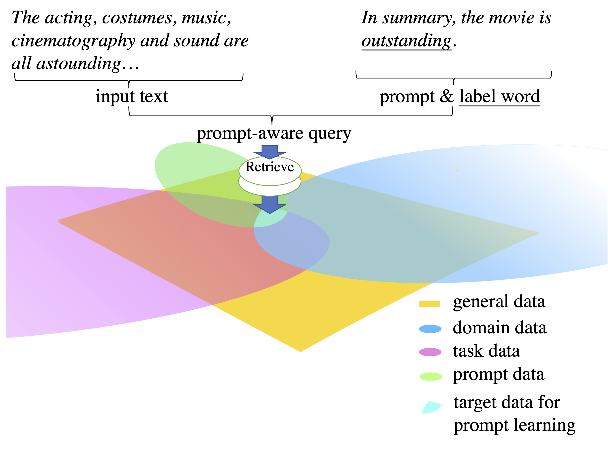
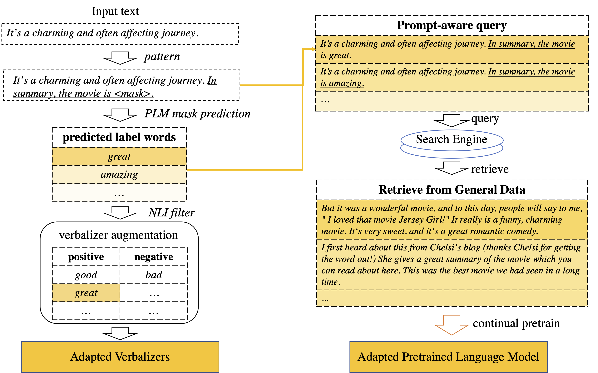

# AdaPrompt

<p align="center">
    
</p>


In this work, we introduce, **AdaPrompt** a framwork that retrieves data from large raw text for continual pre-training prompt-based systems.

*[AdaPrompt: Adaptive Model Training for Prompt-based NLP](https://aclanthology.org/2022.findings-emnlp.448/)*


## AdaPrompt


<p align="center">
    
</p>


As shown in the above figure, First, we use the Roberta-large to give labels on those samples using prompt as shown in the paper. 
In particular, for example, given a sentence ```"I like the movie"```, we first convert all data into ```"X. In summary, the movie is <MASK>."```, i.e. ```"I like the movie. In summary, the movie is <MASK>,"```.
Then we use Roberta large to label them and obtain the top-K words to have the sentences like: ```"X. In summary, the movie is good"```, ```"X. In summary, the movie is great"```, ```"X. In summary, the movie is interesting"```, etc.
These sentences will be then used as queries to retrieve raw data using the Elastic.

For elastic (https://www.elastic.co/), we index the data which is used for Roberta pretaining on sentence level.

After having the retrieved data, we first deduplicate them, and use them for continual pretraining (https://github.com/allenai/dont-stop-pretraining).

For PET experiments, we use the code from https://github.com/timoschick/pet.


If you find our paper interesting, please kindly cite our paper:
```
@inproceedings{chen-etal-2022-adaprompt,
    title = "{A}da{P}rompt: Adaptive Model Training for Prompt-based {NLP}",
    author = "Chen, Yulong  and
      Liu, Yang  and
      Dong, Li  and
      Wang, Shuohang  and
      Zhu, Chenguang  and
      Zeng, Michael  and
      Zhang, Yue",
    editor = "Goldberg, Yoav  and
      Kozareva, Zornitsa  and
      Zhang, Yue",
    booktitle = "Findings of the Association for Computational Linguistics: EMNLP 2022",
    month = dec,
    year = "2022",
    address = "Abu Dhabi, United Arab Emirates",
    publisher = "Association for Computational Linguistics",
    url = "https://aclanthology.org/2022.findings-emnlp.448",
    doi = "10.18653/v1/2022.findings-emnlp.448",
    pages = "6057--6068",
    abstract = "Prompt-based learning, with its capability to tackle zero-shot and few-shot NLP tasks, has gained much attention in the community. The main idea is to bridge the gap between NLP downstream tasks and language modeling (LM), by mapping these tasks into natural language prompts, which are then filled by pre-trained language models (PLMs).However, for prompt learning, there are still two salient gaps between NLP tasks and pretraining. First, prompt information is not necessarily sufficiently present during LM pre-training. Second, task-specific data are not necessarily well represented during pre-training. We address these two issues by proposing AdaPrompt, adaptively retrieving external data for continual pretraining of PLMs by making use of both task and prompt characteristics. In addition, we make use of knowledge in Natural Language Inference models for deriving adaptive verbalizers.Experimental results on five NLP benchmarks show that AdaPrompt can improve over standard PLMs in few-shot settings. In addition, in zero-shot settings, our method outperforms standard prompt-based methods by up to 26.35{\%} relative error reduction.",
}
```
